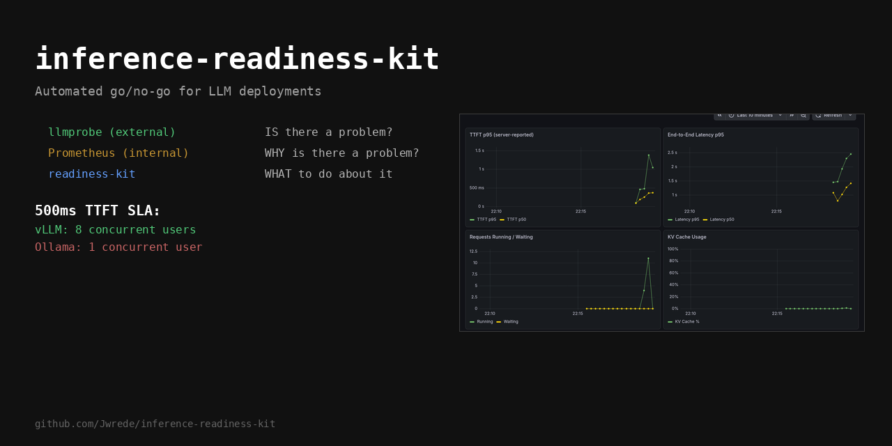
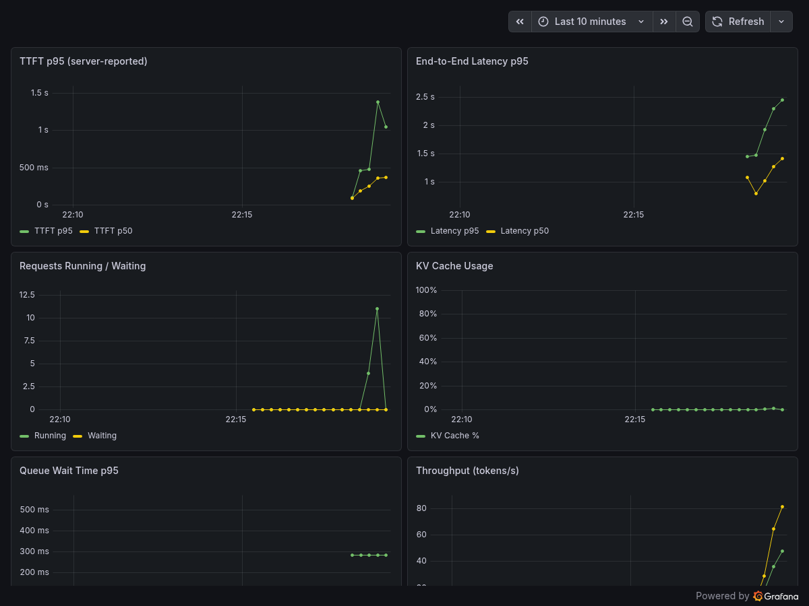

# inference-readiness-kit



Automated go/no-go decisions for LLM inference deployments.

Like readiness probes for Kubernetes, but for LLM inference SLAs. Combines external acceptance testing ([llmprobe](https://github.com/Jwrede/llmprobe)) with internal server telemetry (Prometheus) to make deployment decisions.


## The problem

Server metrics say "healthy" while users experience 3-second TTFT. The load balancer is misconfigured, TLS adds overhead, the rate limiter is throttling, or the model is silently returning empty responses. Server-side metrics alone often miss this because they do not measure the full client path. You need an external validator.

## How it works

```
llmprobe (external)  ──>  IS there a problem?     (client-side truth)
Prometheus (internal) ──>  WHY is there a problem?  (server-side explanation)
readiness-kit         ──>  WHAT to do about it      (automated verdict)
```

## Three workflows

### 1. Gate (CI/CD)

Deploy a new model, run acceptance probes, get a binary pass/fail. Exit code 0 or 1.

```bash
./scripts/gate.sh configs/llmprobe/vllm.yml thresholds.yml 30s 5s
# GATE: PASS -- safe to route traffic
# GATE: FAIL -- do not route traffic
```

Integrates into any CI/CD pipeline. No human in the loop.

### 2. Diagnose (incident response)

Users report slow responses. Correlate client observations with server state.

```bash
python3 scripts/diagnose.py runs/latest/llmprobe.jsonl --prometheus http://localhost:9090
```

Output tells you whether the problem is in the network layer (client/server TTFT gap), the inference engine (queue depth, KV cache pressure), or upstream (errors, timeouts).

### 3. Capacity (planning)

Find the concurrency level where your endpoint breaks its SLA.

```bash
./scripts/sweep.sh configs/llmprobe/vllm.yml 1,2,4,8,16
```

Produces a comparison table showing how TTFT, latency, and throughput degrade under load. Tells you exactly how many concurrent users your config supports within SLA.

## Quick start

Prerequisites: [llmprobe](https://github.com/Jwrede/llmprobe) v1.4.0+, Python 3.10+.

```bash
go install github.com/Jwrede/llmprobe@latest
pip install pyyaml
git clone https://github.com/Jwrede/inference-readiness-kit && cd inference-readiness-kit

# Point at your endpoint (vLLM, Ollama, or any OpenAI-compatible server)
vim configs/llmprobe/vllm.yml

# Run the readiness gate (exit 0 = pass, exit 1 = fail)
./scripts/gate.sh configs/llmprobe/vllm.yml thresholds.yml 30s 5s

# Find the concurrency breaking point
./scripts/sweep.sh configs/llmprobe/vllm.yml 1,2,4,8,16

# Diagnose with server-side metrics (requires Prometheus scraping your endpoint)
python3 scripts/diagnose.py runs/latest/llmprobe.jsonl --prometheus http://localhost:9090
```

## Configuration

**thresholds.yml** defines your SLA contract:

```yaml
sla:
  ttft_ms: 500          # Max acceptable TTFT (p95)
  latency_ms: 10000     # Max acceptable end-to-end latency (p95)
  min_throughput: 3.0   # Min acceptable throughput (p50, tok/s)
  max_error_rate: 0.01  # Max acceptable error rate

gate:
  min_probes: 5         # Minimum probes before making a decision
  pass_rate: 0.95       # Required healthy probe rate
```

**configs/prometheus/queries.yml** defines which server metrics to collect for diagnosis.

## Running Prometheus with vLLM

vLLM exposes a `/metrics` endpoint by default. To correlate client probes with server telemetry:

```bash
# 1. Start vLLM (Docker CPU example)
docker run -d --name vllm -p 8000:8000 \
  vllm/vllm-openai-cpu:latest \
  --model Qwen/Qwen2-0.5B-Instruct --max-model-len 512

# 2. Start Prometheus
cp prometheus.example.yml prometheus.yml
# Edit prometheus.yml target if vLLM is not on host.docker.internal:8000
docker run -d --name prometheus -p 9090:9090 \
  --add-host=host.docker.internal:host-gateway \
  -v $(pwd)/prometheus.yml:/etc/prometheus/prometheus.yml:ro \
  prom/prometheus:latest

# 3. Verify scraping works
curl -s http://localhost:9090/api/v1/targets | grep '"health":"up"'

# 4. Run probes and diagnose
./scripts/gate.sh configs/llmprobe/vllm.yml thresholds.yml 30s 5s
python3 scripts/diagnose.py runs/latest/llmprobe.jsonl --prometheus http://localhost:9090
```

The diagnosis correlates client-observed TTFT with server-reported TTFT. A large gap (>100ms) indicates network or proxy overhead between the client and the inference engine.

## Grafana Dashboard

A pre-built dashboard visualizes the same metrics used by `scripts/diagnose.py`. Grafana is for inspection; the readiness gate remains the source of deployment decisions.

```bash
# 1. Make sure prometheus.yml exists
cp prometheus.example.yml prometheus.yml

# 2. Start Prometheus + Grafana (Grafana on port 3001)
docker compose -f docker-compose.observability.yml up -d

# 3. Open in browser
open http://localhost:3001/d/vllm-readiness
# Login: admin / admin (or anonymous access enabled by default)
```



Panels: TTFT p95/p50, end-to-end latency, running/waiting requests, KV cache usage, queue wait time, token throughput. Color thresholds match the SLA defaults in `thresholds.yml`.

To stop:

```bash
docker compose -f docker-compose.observability.yml down
```

## Real experiment results

Concurrency sweep on Qwen2 0.5B, 8 vCPUs, 16GB RAM, no GPU:

| Concurrency | vLLM TTFT p50 | Ollama TTFT p50 | vLLM tok/s | Ollama tok/s |
|-------------|---------------|-----------------|------------|--------------|
| 1 | 110ms | 204ms | 16.4 | 42.3 |
| 4 | 225ms | 750ms | 17.5 | 59.3 |
| 8 | 327ms | 2.50s | 15.4 | 51.8 |
| 16 | 591ms | 6.90s | 10.7 | 53.1 |

Ollama wins on raw throughput (Q4 quantization + llama.cpp). vLLM wins on TTFT stability under load (continuous batching). For a 500ms TTFT SLA: vLLM supports 8 concurrent users, Ollama supports 1.

Full analysis: [reports/examples/cross-engine-comparison.md](reports/examples/cross-engine-comparison.md)

## Example outputs

- [Readiness report (healthy)](reports/examples/sample-readiness-report.md)
- [Readiness report (SLA violation at c16)](reports/examples/vllm-cpu-c16-readiness-report.md)
- [Concurrency sweep (vLLM)](reports/examples/vllm-cpu-concurrency-sweep.md)
- [Cross-engine comparison](reports/examples/cross-engine-comparison.md)
- [Prometheus diagnosis (c16 under load)](reports/examples/prometheus-diagnosis-c16.md)

## Project structure

```
thresholds.yml                    # SLA contract
prometheus.example.yml            # Prometheus config template
docker-compose.observability.yml  # Prometheus + Grafana stack
grafana/
  dashboard.json                  # Pre-built vLLM dashboard
  provisioning/                   # Auto-config for datasource + dashboard
configs/
  llmprobe/vllm.yml              # vLLM probe configuration
  llmprobe/ollama.yml            # Ollama probe configuration
  prometheus/queries.yml          # Server-side metric queries
scripts/
  gate.sh                        # CI/CD readiness gate (exit 0/1)
  diagnose.py                    # Client + server correlation
  sweep.sh                       # Concurrency sweep
  compare.py                     # Sweep comparison table
  report.py                      # Full readiness report with verdict
fixtures/                        # Test data
tests/                           # pytest suite
runbooks/                        # Failure mode runbooks
reports/examples/                # Example outputs
.github/workflows/ci.yml        # CI (pytest + shellcheck)
```

## Roadmap

- [x] Readiness gate with SLA thresholds
- [x] Diagnosis framework (client-only and with Prometheus)
- [x] Concurrency sweep with comparison
- [x] Real vLLM CPU experiment with published results
- [x] Cross-engine comparison (vLLM vs Ollama)
- [x] Prometheus-based server-side correlation with live data
- [x] Runbooks for common failure modes

## License

MIT
