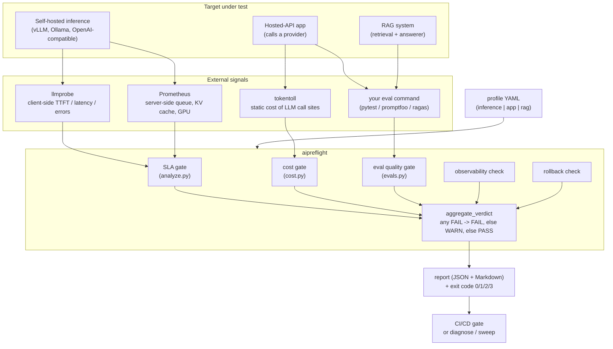

# Architecture

aipreflight turns external acceptance testing and internal telemetry into one
ship/block verdict. A **profile** declares what "ready" means for one kind of
target. Each check returns a `CheckResult`, the results aggregate into a single
verdict, and the verdict becomes a report plus a process exit code that any CI
pipeline can gate on.

## The contract

Every check, regardless of profile kind, produces the same `CheckResult`
(name, status, summary, details). `aggregate_verdict` reduces them with one rule:
any `FAIL` makes the run `FAIL`, otherwise any `WARN` makes it `WARN`, otherwise
`PASS`. A `SKIP` (an optional section was absent) never moves the verdict. That
uniformity is why a GPU SLA gate, a static cost estimate, and a RAG eval suite
can share one report and one exit code.

## Exit-code contract

| Code | Meaning |
|------|---------|
| 0 | readiness pass (PASS or WARN) |
| 1 | readiness fail (FAIL) |
| 2 | invalid config or missing dependency |
| 3 | probe or eval execution error |

## Why two signal sources for inference

Server metrics can report "healthy" while users wait seconds for the first
token, because server-side metrics do not measure the full client path.
llmprobe answers *is* there a problem from outside the server. Prometheus
answers *why* by exposing queue depth, KV cache pressure, and GPU state.
aipreflight correlates the two and decides *what* to do.
